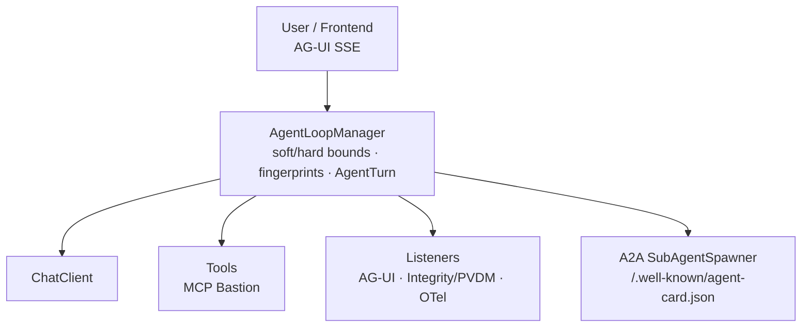

# Spring AI Loop Engine

**Enterprise Loop Engineering for [Spring AI](https://docs.spring.io/spring-ai/reference/)** — stateful, budgeted agent loops with AG-UI streaming, A2A sub-agents, MCP Bastion RBAC, integrity gates / PVDM attestations, and OpenTelemetry GenAI observability.

| | |
|--|--|
| **Repo** | [github.com/vaquarkhan/spring-ai-loop-engine](https://github.com/vaquarkhan/spring-ai-loop-engine) |
| **Starter** | `spring-ai-starter-loop-engine` |
| **GroupId** | `io.github.vaquarkhan` |
| **License** | [Apache 2.0](LICENSE) |
| **Java / Boot / AI** | 21+ · Spring Boot 3.5.x · Spring AI 1.1.x |
| **Community** | [Proposal #28](https://github.com/spring-ai-community/community/issues/28) |

> Developers are **loop architects**, not turn-by-turn prompt engineers. You define the goal, tools, and guardrails; the engine runs try → tool → observe → self-correct until the goal is met (within soft/hard round bounds).

---

## Table of contents

1. [Overview](#overview)
2. [Documentation map](#documentation-map)
3. [Core capabilities](#core-capabilities)
4. [Architecture](#architecture)
5. [Modules](#modules)
6. [Quick start](#quick-start)
7. [Configuration (`spring.ai.loop.*`)](#configuration-springailoop)
8. [Examples (real-world use cases)](#examples-real-world-use-cases)
9. [Build from source](#build-from-source)
10. [IDE / MCP clients](#ide--mcp-clients)
11. [Naming & community](#naming--community)
12. [Contributing](#contributing)
13. [License](#license)

---

## Overview

Manual prompt engineering does not scale for enterprise agents. Modern systems use **autonomous loops**: the model calls tools, reads results, and iterates until the objective succeeds — or hits a hard safety bound.

**Spring AI Loop Engine** wraps Spring AI (`ChatClient`, `ToolCallback`) with:

| Concern | What you get |
|---------|----------------|
| **Loop runtime** | `AgentLoopManager` + `AgentTurn` state per message |
| **Runaway protection** | Soft max (wrap-up) + hard max (stop) round budgets |
| **Retry hygiene** | Fingerprint tool args; block duplicate failed actions |
| **UI streaming** | AG-UI events over WebFlux SSE |
| **Multi-agent** | A2A-style `SubAgentSpawner` + AgentCard |
| **Zero-trust tools** | MCP Bastion RBAC before tool execution |
| **Audit / quality** | Integrity gates + PVDM HMAC attestations |
| **Observability** | GenAI OTel spans + PII masking helper |

Prefer `AgentLoopManager` + `LoopRequest` over custom recursive `ToolCallingAdvisor` chains.

---

## Documentation map

Start here depending on who you are:

| Audience | Read |
|----------|------|
| **New developer** | **[Tutorial](docs/tutorial.md)** — Labs 0–14 (demo → ChatClient → tools → AG-UI → Bastion → PVDM → OTel → A2A → HITL) |
| **Integrator / architect** | **[Developer Guide](docs/developer-guide.md)** — full API, properties, production checklist, known limitations |
| **Docs index** | [docs/README.md](docs/README.md) |
| **Manager / click-through** | [docs/demo-preview.html](docs/demo-preview.html) (offline simulation) or run [simple-loop-app](examples/simple-loop-app/README.md) |
| **Per-module detail** | Each module folder `README.md` (linked in [Modules](#modules)) |
| **Contributing** | [CONTRIBUTING.md](CONTRIBUTING.md) |

| Doc | Description |
|-----|-------------|
| [docs/developer-guide.md](docs/developer-guide.md) | Install, `spring.ai.loop.*`, APIs, modules, troubleshooting |
| [docs/tutorial.md](docs/tutorial.md) | Hands-on end-to-end labs |
| [docs/demo-preview.html](docs/demo-preview.html) | Offline manager UI (simulation only) |
| [docs/cursor-setup.md](docs/cursor-setup.md) | Optional MCP editor wiring notes |
| [docs/proposal-update.md](docs/proposal-update.md) | Community proposal draft text |

---

## Core capabilities

### AgentLoopManager

Decorates Spring AI tool-calling with a stateful loop: tracks `AgentTurn`, enforces **soft** and **hard** round bounds, and fingerprints tool arguments so the model cannot retry the exact same failed action forever.

### AG-UI (real-time frontend streaming)

WebFlux SSE emits AG-UI events (`RunStartedEvent`, `TOOL_CALL_START`, `STATE_DELTA`, `RunFinishedEvent`, …) so UIs can render progress. HITL building blocks (`HitlApprovalStore`, approval HTTP) are included for human approval flows.

### A2A sub-agent spawning

`SubAgentSpawner` runs nested loops with their own soft/hard budgets. Agent discovery via `GET /.well-known/agent-card.json`. Compose with community `spring-ai-a2a` for full inter-process A2A.

### Zero-trust governance (MCP Bastion + PVDM)

**MCP Bastion** enforces RBAC before tools run. **PVDM** decision attestations (HMAC) record tool and loop completion provenance. Output gates (density, dependency, YAML design) flag risky outputs.

### Observability & DLP

`GenAiLoopTelemetryListener` emits OpenTelemetry GenAI-oriented spans. `PiiMaskingSpanExporter` helps redact emails / SSNs / API-key-like strings before export.

### MCP IDE clients

Utilities generate `mcp.json` for MCP-capable IDEs. Your app still exposes the MCP server (Spring AI MCP); Bastion should front tool execution.

---

## Architecture



**Mental model:** you design goals + tool circuits + budgets; listeners handle streaming, attestation, and telemetry.

---

## Modules

Maven multi-module layout. Add the **starter** for everything, or pick modules via the **BOM**.

| Module | Artifact | Package | Role |
|--------|----------|---------|------|
| [spring-ai-loop-engine-core](spring-ai-loop-engine-core/README.md) | `spring-ai-loop-engine-core` | `io.github.vaquarkhan.loopengine.core` | `AgentLoopManager`, `LoopRequest`, `AgentTurn`, `ChatClientLoopModelClient`, fingerprinting, `LoopEngineProperties` |
| [spring-ai-loop-engine-agui](spring-ai-loop-engine-agui/README.md) | `spring-ai-loop-engine-agui` | `…loopengine.agui` | AG-UI SSE (`/api/loop/ag-ui`), `HitlApprovalStore`, approvals API |
| [spring-ai-loop-engine-a2a](spring-ai-loop-engine-a2a/README.md) | `spring-ai-loop-engine-a2a` | `…loopengine.a2a` | `SubAgentSpawner`, AgentCard at `/.well-known/agent-card.json` |
| [spring-ai-loop-engine-mcp](spring-ai-loop-engine-mcp/README.md) | `spring-ai-loop-engine-mcp` | `…loopengine.mcp` | `McpBastionToolExecutor`, `ToolPermissionEvaluator`, `mcp.json` generator |
| [spring-ai-loop-engine-integrity](spring-ai-loop-engine-integrity/README.md) | `spring-ai-loop-engine-integrity` | `…loopengine.integrity` | Density / dependency / YAML gates + PVDM `DecisionAttestation` |
| [spring-ai-loop-engine-observability](spring-ai-loop-engine-observability/README.md) | `spring-ai-loop-engine-observability` | `…loopengine.observability` | GenAI OTel listener + `PiiMaskingSpanExporter` |
| [spring-ai-starter-loop-engine](spring-ai-starter-loop-engine/README.md) | `spring-ai-starter-loop-engine` | `…loopengine.starter` | Zero-config starter (pulls all feature modules) |
| [spring-ai-loop-engine-bom](spring-ai-loop-engine-bom/README.md) | `spring-ai-loop-engine-bom` | — | Bill of Materials for version alignment |
| [examples/](examples/README.md) | several apps | — | Runnable demos (no API key) |
| [docs/](docs/README.md) | — | — | Guides, tutorial, offline preview |
| [scripts/](scripts/README.md) | — | — | Helper scripts |
| [.github/workflows/](.github/workflows/README.md) | — | — | CI (`mvn verify`, JDK 21) |

### Module highlights

<details>
<summary><strong>core</strong> — loop runtime</summary>

- `AgentLoopManager.run(LoopRequest)` → `LoopResult`
- Soft wrap prompt at soft-max; `HardMaxRoundsExceededException` at hard-max
- `ArgumentFingerprinter` + duplicate failed-action blocking
- Default `ChatClientLoopModelClient` with **internal tool execution off** (engine owns tools)

</details>

<details>
<summary><strong>agui</strong> — streaming UI</summary>

- `POST /api/loop/ag-ui` — SSE run (WebFlux / reactive)
- `POST /api/loop/approvals/{id}` — HITL decision
- Events: `RunStartedEvent`, `STATE_DELTA`, `TOOL_CALL_*`, `TEXT_MESSAGE`, `RunFinishedEvent`, `APPROVAL_REQUIRED`, `ERROR`

</details>

<details>
<summary><strong>a2a</strong> — sub-agents</summary>

- `SubAgentSpawner.spawn(goal, systemPrompt, soft, hard)`
- AgentCard JSON for discovery metadata

</details>

<details>
<summary><strong>mcp</strong> — Bastion RBAC</summary>

- Wraps `ToolExecutor` when `bastion-enabled=true`
- Default `permitAll`; supply `ToolPermissionEvaluator.allowList(...)` for production
- Optional `.cursor/mcp.json` generation (points at your MCP SSE URL)

</details>

<details>
<summary><strong>integrity</strong> — gates + PVDM</summary>

- Gates on turn completion (advisory attributes today)
- HMAC attestations for tool execution and loop completion — replace signer bean for durable secrets

</details>

<details>
<summary><strong>observability</strong> — OTel</summary>

- Span `agent.loop.turn` + round/tool events
- Wire `PiiMaskingSpanExporter` around your OTLP exporter manually

</details>

---

## Quick start

### 1. Dependency

```xml
<dependency>
  <groupId>io.github.vaquarkhan</groupId>
  <artifactId>spring-ai-starter-loop-engine</artifactId>
  <version>0.1.0-SNAPSHOT</version>
</dependency>
```

Until published to Maven Central, build this repo first: `mvn -DskipTests install`.

### 2. Config

```yaml
spring:
  main:
    web-application-type: reactive   # required for AG-UI
  ai:
    openai:
      api-key: ${OPENAI_API_KEY}
    loop:
      soft-max-rounds: 15
      hard-max-rounds: 25
      block-duplicate-failed-actions: true
```

### 3. Run a loop

```java
@Autowired AgentLoopManager loops;

LoopResult result = loops.run(LoopRequest.builder()
    .sessionId("ops-1")
    .userMessage("Reconcile yesterday's failed invoices")
    .systemPrompt("You are a careful finance operations agent.")
    .build());

System.out.println(result.content());
System.out.println(result.terminationReason());
```

Next: follow the **[Tutorial](docs/tutorial.md)** or skim the **[Developer Guide](docs/developer-guide.md)**.

---

## Configuration (`spring.ai.loop.*`)

| Property | Default | Meaning |
|----------|---------|---------|
| `spring.ai.loop.enabled` | `true` | Core auto-config |
| `spring.ai.loop.soft-max-rounds` | `15` | Inject wrap-up; suppress further tools |
| `spring.ai.loop.hard-max-rounds` | `25` | Force stop (must be ≥ soft) |
| `spring.ai.loop.block-duplicate-failed-actions` | `true` | Fingerprint block on identical failures |
| `spring.ai.loop.agui.enabled` | `true` | AG-UI SSE |
| `spring.ai.loop.agui.sse-path` | `/api/loop/ag-ui` | |
| `spring.ai.loop.a2a.enabled` | `true` | Spawner + AgentCard |
| `spring.ai.loop.mcp.bastion-enabled` | `true` | Wrap tools with Bastion |
| `spring.ai.loop.integrity.enabled` | `true` | Gates + PVDM listener |
| `spring.ai.loop.observability.enabled` | `true` | GenAI loop spans |

Full nested tree (AG-UI paths, Bastion, gates, OTel): **[Developer Guide §4](docs/developer-guide.md#4-configuration-reference-springailoop)**.

---

## Examples (real-world use cases)

**GitHub does not run these apps.** Build and start locally (JDK 21+). No LLM API key required — each uses a scenario-driven demo model.

| Example | Port | Domain | Highlights |
|---------|------|--------|------------|
| [simple-loop-app](examples/simple-loop-app/README.md) | **8080** | Getting started | Manager HTML UI, **live + simulation** fallback, soft wrap, fingerprint, A2A, AG-UI |
| [invoice-reconciliation-loop](examples/invoice-reconciliation-loop/README.md) | **8081** | Finance / AP | Match payment ↔ invoice, open exceptions, duplicate ERP retry blocked |
| [support-triage-loop](examples/support-triage-loop/README.md) | **8082** | Customer support | Ticket → customer → KB → draft/escalate; A2A billing specialist |
| [incident-response-loop](examples/incident-response-loop/README.md) | **8083** | SRE / DevOps | Alerts → logs → SLO; Bastion RBAC on `restart_service` |

### Getting-started UI

```bash
mvn -pl examples/simple-loop-app -am install -DskipTests
mvn -pl examples/simple-loop-app spring-boot:run
# open http://localhost:8080/
```

Offline simulation (no server): open [docs/demo-preview.html](docs/demo-preview.html) in a browser.

### Real-world curls

```bash
# Finance — underpayment exception
curl -s -X POST http://localhost:8081/api/reconcile -H "Content-Type: application/json" \
  -d "{\"message\":\"reconcile INV-1042 mismatch short pay\"}"

# Support — A2A specialist
curl -s -X POST http://localhost:8082/api/triage/billing-specialist -H "Content-Type: application/json" \
  -d "{\"message\":\"billing charge refund triage\"}"

# SRE — Bastion deny vs on-call
curl -s -X POST http://localhost:8083/api/incident -H "Content-Type: application/json" \
  -d "{\"message\":\"remediate restart checkout\",\"actor\":\"analyst\"}"
curl -s -X POST http://localhost:8083/api/incident -H "Content-Type: application/json" \
  -d "{\"message\":\"remediate restart checkout\",\"actor\":\"sre-oncall\"}"
```

Full index: **[examples/README.md](examples/README.md)**.

---

## Build from source

```bash
git clone https://github.com/vaquarkhan/spring-ai-loop-engine.git
cd spring-ai-loop-engine
mvn verify          # full test suite
mvn -DskipTests install
```

CI: [.github/workflows/build.yml](.github/workflows/build.yml) runs `mvn verify` on JDK 21.

---

## IDE / MCP clients

1. Expose your MCP server (SSE or STDIO) with Spring AI MCP in your app.
2. Point an `mcp.json` at that endpoint (starter can generate a template):

```json
{
  "mcpServers": {
    "spring-ai-loop-engine": {
      "url": "http://localhost:8080/sse"
    }
  }
}
```

3. Route tool calls through **MCP Bastion** RBAC — do not bypass Bastion in apps that claim production patterns.

Notes: [docs/cursor-setup.md](docs/cursor-setup.md).

---

## Naming & community

| Item | Value |
|------|-------|
| Repository | `spring-ai-loop-engine` |
| Starter | `spring-ai-starter-loop-engine` |
| GroupId (pre-incubation) | `io.github.vaquarkhan` |
| License | Apache 2.0 |

- Community proposal: [spring-ai-community/community#28](https://github.com/spring-ai-community/community/issues/28)
- Reference patterns: [ai-agent-java-sdk](https://github.com/vaquarkhan/ai-agent-java-sdk)
- Compose with community work (`spring-ai-a2a`, AG-UI proposals, agentcore) — do not duplicate incubated projects

| Stack | Version |
|-------|---------|
| Java | 21+ |
| Spring Boot | 3.5.x (`spring-ai-2` profile reserved for Boot 4 / Spring AI 2.0) |
| Spring AI | 1.1.x |

---

## Contributing

See [CONTRIBUTING.md](CONTRIBUTING.md). Soft/hard loop bounds are required for any new execution path. Prefer auto-configuration and Spring AI compatibility (`ChatClient` / `ToolCallback` wrappers, not forks).

```bash
mvn -q verify
```

---

## License

[Apache License 2.0](LICENSE)
