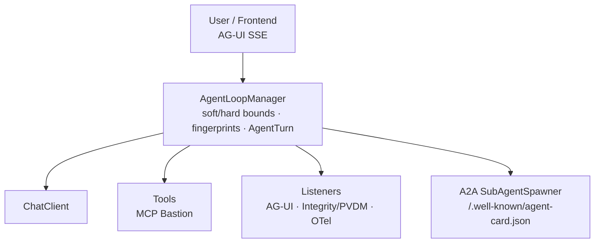
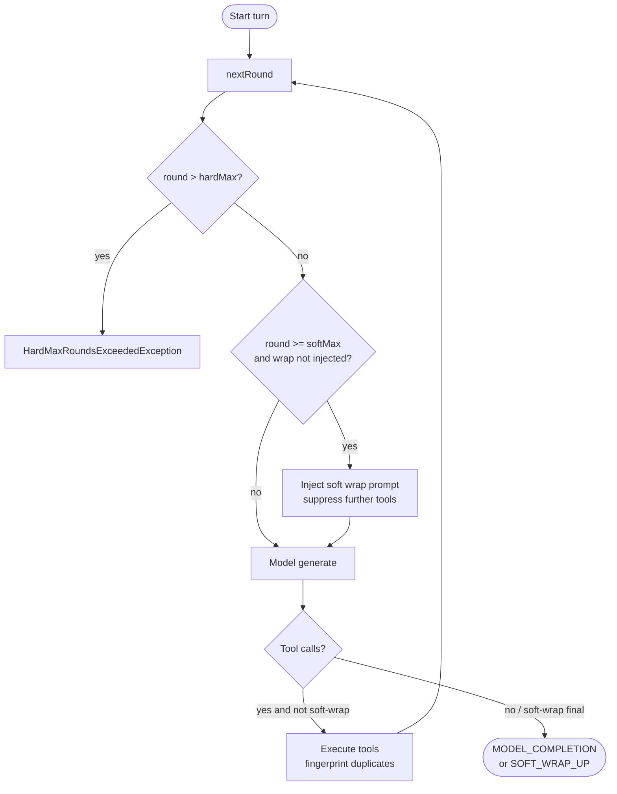

# Spring AI Loop Engine — Developer Guide

Complete reference for building with **spring-ai-loop-engine**. For a hands-on walkthrough, see the [Tutorial](tutorial.md). For managers / click-through demos, see the [Example](../examples/simple-loop-app/README.md) and [offline preview](demo-preview.html).

| Doc | Audience |
|-----|----------|
| This guide | Developers integrating the engine |
| [Tutorial](tutorial.md) | Step-by-step from zero to production patterns |
| [Root README](../README.md) | Product overview |
| Per-module `README.md` | Package-level notes |

---

## Table of contents

1. [Mental model](#1-mental-model)
2. [Prerequisites](#2-prerequisites)
3. [Install & dependency setup](#3-install--dependency-setup)
4. [Configuration reference](#4-configuration-reference-springailoop)
5. [Core loop API](#5-core-loop-api)
6. [Tools & fingerprinting](#6-tools--fingerprinting)
7. [AG-UI streaming & HITL](#7-ag-ui-streaming--hitl)
8. [A2A sub-agents & AgentCard](#8-a2a-sub-agents--agentcard)
9. [MCP Bastion (RBAC)](#9-mcp-bastion-rbac)
10. [Integrity gates & PVDM](#10-integrity-gates--pvdm)
11. [Observability & PII](#11-observability--pii)
12. [Listeners & extension SPI](#12-listeners--extension-spi)
13. [Module map](#13-module-map)
14. [Example application](#14-example-application)
15. [Production checklist](#15-production-checklist)
16. [Known limitations](#16-known-limitations-current-release)
17. [Troubleshooting](#17-troubleshooting)
18. [Contributing & tests](#18-contributing--tests)

---

## 1. Mental model

You are a **loop architect**, not a turn-by-turn prompt engineer.

| You design | The engine runs |
|------------|-----------------|
| Business goal (`userMessage`) | Model ↔ tool rounds |
| Tools (`ToolCallback` / `ToolExecutor`) | Soft wrap-up then hard stop |
| Soft / hard round budgets | Fingerprint block on duplicate failures |
| RBAC, gates, attestations | Listeners (AG-UI, OTel, integrity) |

Prefer `AgentLoopManager` + `LoopRequest` over custom recursive `ToolCallingAdvisor` chains. The engine **wraps** Spring AI (`ChatClient`, `ToolCallback`); it does not fork them.



---

## 2. Prerequisites

| Requirement | Version / notes |
|-------------|-----------------|
| JDK | **21+** |
| Maven | 3.9+ recommended |
| Spring Boot | **3.5.x** (profile `spring-ai-2` reserved for Boot 4 / Spring AI 2.0) |
| Spring AI | **1.1.x** |
| Web stack for AG-UI | **WebFlux** (`spring.main.web-application-type=reactive`) |

Clone and verify:

```bash
git clone https://github.com/vaquarkhan/spring-ai-loop-engine.git
cd spring-ai-loop-engine
mvn verify
```

---

## 3. Install & dependency setup

### Option A — Starter (recommended)

```xml
<dependency>
  <groupId>io.github.vaquarkhan</groupId>
  <artifactId>spring-ai-starter-loop-engine</artifactId>
  <version>0.1.0-SNAPSHOT</version>
</dependency>
```

Pulls core, AG-UI, A2A, MCP, integrity, and observability with auto-configuration.

### Option B — BOM + selective modules

```xml
<dependencyManagement>
  <dependencies>
    <dependency>
      <groupId>io.github.vaquarkhan</groupId>
      <artifactId>spring-ai-loop-engine-bom</artifactId>
      <version>0.1.0-SNAPSHOT</version>
      <type>pom</type>
      <scope>import</scope>
    </dependency>
  </dependencies>
</dependencyManagement>

<dependencies>
  <dependency>
    <groupId>io.github.vaquarkhan</groupId>
    <artifactId>spring-ai-loop-engine-core</artifactId>
  </dependency>
  <!-- add agui / a2a / mcp / integrity / observability as needed -->
</dependencies>
```

### Option C — Build from source (this repo)

```bash
mvn -DskipTests install
```

Then depend on `0.1.0-SNAPSHOT` locally.

### What auto-config expects

| Bean / condition | Required for |
|------------------|--------------|
| `ChatClient.Builder` | Default `LoopModelClient` (`ChatClientLoopModelClient`) |
| `ToolCallbackProvider` beans (optional) | Default `ToolExecutor` |
| Reactive web application | AG-UI SSE controller |
| Any `LoopListener` beans | Fan-out from `AgentLoopManager` |

The **example app** replaces `LoopModelClient` with a `@Primary` demo client so it runs **without an LLM API key**. Production apps normally keep the ChatClient-backed client and set a real provider key.

---

## 4. Configuration reference (`spring.ai.loop.*`)

Source of truth: `io.github.vaquarkhan.loopengine.core.config.LoopEngineProperties`.

### Core

| Property | Default | Description |
|----------|---------|-------------|
| `spring.ai.loop.enabled` | `true` | Master switch for core auto-config |
| `spring.ai.loop.soft-max-rounds` | `15` | Soft budget: inject wrap-up; suppress further tools |
| `spring.ai.loop.hard-max-rounds` | `25` | Hard budget: throw `HardMaxRoundsExceededException` |
| `spring.ai.loop.block-duplicate-failed-actions` | `true` | Block identical failed tool+args in the same turn |
| `spring.ai.loop.system-prompt` | careful-agent text | Used when the request has no system prompt |

Constraint: `hard-max-rounds` must be **≥** `soft-max-rounds`.

### AG-UI

| Property | Default |
|----------|---------|
| `spring.ai.loop.agui.enabled` | `true` |
| `spring.ai.loop.agui.sse-path` | `/api/loop/ag-ui` |
| `spring.ai.loop.agui.approval-path` | `/api/loop/approvals` |

### A2A

| Property | Default |
|----------|---------|
| `spring.ai.loop.a2a.enabled` | `true` |
| `spring.ai.loop.a2a.agent-card-path` | `/.well-known/agent-card.json` |
| `spring.ai.loop.a2a.agent-name` | `spring-ai-loop-engine` |
| `spring.ai.loop.a2a.agent-description` | Stateful Spring AI agent loop… |
| `spring.ai.loop.a2a.default-sub-agent-token-budget` | `8000` | Logged today; **not enforced** as a hard token cap |

### MCP

| Property | Default |
|----------|---------|
| `spring.ai.loop.mcp.enabled` | `true` |
| `spring.ai.loop.mcp.bastion-enabled` | `true` |
| `spring.ai.loop.mcp.generate-cursor-config` | `true` |
| `spring.ai.loop.mcp.cursor-config-path` | `.cursor/mcp.json` |

### Integrity

| Property | Default |
|----------|---------|
| `spring.ai.loop.integrity.enabled` | `true` |
| `spring.ai.loop.integrity.pvdm-enabled` | `true` |
| `spring.ai.loop.integrity.density-gate-enabled` | `true` |
| `spring.ai.loop.integrity.dependency-gate-enabled` | `true` |
| `spring.ai.loop.integrity.min-logic-density` | `0.15` |

### Observability

| Property | Default | Notes |
|----------|---------|-------|
| `spring.ai.loop.observability.enabled` | `true` | Registers `GenAiLoopTelemetryListener` |
| `spring.ai.loop.observability.pii-masking-enabled` | `true` | Declared; wire `PiiMaskingSpanExporter` manually (see §11) |

### Example `application.yml`

```yaml
spring:
  main:
    web-application-type: reactive
  ai:
    openai:
      api-key: ${OPENAI_API_KEY}
    loop:
      soft-max-rounds: 10
      hard-max-rounds: 20
      block-duplicate-failed-actions: true
      agui:
        enabled: true
      a2a:
        enabled: true
        agent-name: finance-ops-agent
      mcp:
        bastion-enabled: true
        generate-cursor-config: true
      integrity:
        enabled: true
        min-logic-density: 0.15
      observability:
        enabled: true
```

---

## 5. Core loop API

### Packages

`io.github.vaquarkhan.loopengine.core.loop` · `.model` · `.tool` · `.config`

### Run a turn

```java
@Autowired AgentLoopManager loops;

LoopResult result = loops.run(LoopRequest.builder()
    .sessionId("ops-session-1")
    .userMessage("Reconcile yesterday's failed invoices")
    .systemPrompt("You are a careful finance operations agent.")
    .softMaxRounds(10)   // optional per-request override
    .hardMaxRounds(20)
    .build());

System.out.println(result.content());
System.out.println(result.terminationReason());
System.out.println(result.roundsExecuted());
System.out.println(result.toolHistory());
```

### Soft vs hard rounds



1. Each iteration calls `AgentTurn.nextRound()`.
2. If `round > hardMax` → `HardMaxRoundsExceededException` (`TerminationReason.HARD_MAX_ROUNDS`).
3. If `round >= softMax` and wrap not yet injected → append `AgentLoopManager.SOFT_WRAP_PROMPT`, mark soft wrap.
4. After soft wrap, tool calls from the model are **suppressed**; the engine asks for a final answer only.
5. Normal completion → `MODEL_COMPLETION` or `SOFT_WRAP_UP`.

### `AgentTurn`

Per-message state: `turnId`, `sessionId`, round counter, soft-wrap flag, suspension flags, tool history, failed fingerprints, attributes. Created by `LoopRequest.newTurn()` unless you supply an existing turn (AG-UI does this so SSE can subscribe by id).

### `LoopResult` / `TerminationReason`

| Reason | Meaning |
|--------|---------|
| `MODEL_COMPLETION` | Model returned a final answer |
| `SOFT_WRAP_UP` | Finished after soft wrap injection |
| `HARD_MAX_ROUNDS` | Hard budget exceeded |
| `HITL_SUSPENDED` / `APPROVAL_DENIED` | Reserved for HITL (see §7 / §16) |
| `VALIDATION_FAILED` | Reserved; gates today are advisory (see §10) |
| `CANCELLED` / `ERROR` | Cancelled or failed turn |

### `LoopModelClient`

Provider-agnostic SPI:

```java
ModelRound generate(AgentTurn turn, List<LoopMessage> messages, boolean softWrapUp);
```

Default bean: `ChatClientLoopModelClient` with **`internalToolExecutionEnabled=false`** so the **engine** owns tool execution (budgets + fingerprints apply). Do not re-enable Spring AI internal tool execution unless you intentionally bypass the loop.

### Conversation history

`LoopRequest.conversationHistory` accepts prior `LoopMessage`s for multi-turn sessions. Wire your own store; the engine does not persist history.

---

## 6. Tools & fingerprinting

### Register Spring AI tools

Provide `ToolCallback` / `ToolCallbackProvider` beans. Auto-config builds a `ToolCallbackToolExecutor` and collects providers.

You can also implement `ToolExecutor` yourself:

```java
@Bean
ToolExecutor myTools() {
    return (turn, invocation) -> {
        // invocation.toolName(), invocation.arguments()
        return ToolExecutor.ToolResult.ok("{\"ok\":true}");
        // or ToolExecutor.ToolResult.failure("{\"error\":\"...\"}");
    };
}
```

### Fingerprinting

1. `ArgumentFingerprinter` hashes `lowercase(toolName)::normalized(args)` (SHA-256; whitespace collapsed).
2. On failure, the fingerprint is stored on the turn.
3. If `block-duplicate-failed-actions` is true and the same tool+args fails again, the engine returns a synthetic JSON error (`duplicate_failed_action`) and fires `onDuplicateToolBlocked` — **no second real call**.

This stops “retry forever with the same broken args” billing loops.

---

## 7. AG-UI streaming & HITL

Requires **WebFlux** / reactive web.

### Endpoints

| Method | Path (default) | Purpose |
|--------|----------------|---------|
| `POST` | `/api/loop/ag-ui` | Start run; body `{sessionId, message, systemPrompt?}` → SSE |
| `GET` | `/api/loop/ag-ui/{turnId}` | Subscribe to an existing turn sink |
| `POST` | `/api/loop/approvals/{approvalId}` | HITL decision `{approved, modifiedArguments?}` |

Loop work runs on `Schedulers.boundedElastic()` so the event loop is not blocked.

### Event types (`AgUiEvent`)

| Type | When |
|------|------|
| `RunStartedEvent` | Turn start |
| `STATE_DELTA` | Round start / soft wrap |
| `TOOL_CALL_START` / `TOOL_CALL_END` | Tool lifecycle |
| `TEXT_MESSAGE` | Final content |
| `RunFinishedEvent` | Completion (+ terminationReason, rounds) |
| `APPROVAL_REQUIRED` | Via `AgUiEventBridge.emitApprovalRequired(...)` |
| `ERROR` | Failure |

### HITL building blocks

- `HitlApprovalStore` — `requestApproval`, `decide`, pending `CompletableFuture`
- Approval HTTP endpoint as above

**Current release:** the store and HTTP API exist, but sensitive tools are **not yet auto-suspended** inside `AgentLoopManager`. To pause on destructive tools today, call `HitlApprovalStore` from a custom `ToolExecutor` / listener and wait on the future before continuing. See [§16](#16-known-limitations-current-release).

---

## 8. A2A sub-agents & AgentCard

### Spawn a worker

```java
@Autowired SubAgentSpawner spawner;

LoopResult worker = spawner.spawn(
    "invoice multi tool demo",
    "You are a focused worker sub-agent.",
    4,   // soft
    6);  // hard
```

Uses `AgentLoopManager` with session id `worker-<uuid>` and increments `spawnCount()`.

This is **local nested spawning**, not a full A2A wire protocol. Compose with community `spring-ai-a2a` when you need inter-process A2A.

### AgentCard

`GET /.well-known/agent-card.json` returns name, description, capabilities (`loop-engine`, `tool-calling`, `hitl`, `soft-hard-bounds`), skill `agent-loop`, and metadata (soft/hard rounds, protocols).

---

## 9. MCP Bastion (RBAC)

### Behavior

When `bastion-enabled=true`, a `BeanPostProcessor` wraps every `ToolExecutor` with `McpBastionToolExecutor`. Before execution, `ToolPermissionEvaluator.isAllowed(principal, toolName)` is checked.

- Default bean: `ToolPermissionEvaluator.permitAll()`
- Principal: Spring Security authentication name if present, else `"anonymous"`
- Deny → `ToolResult.failure` JSON `{"error":"rbac_denied",...}` (model sees failure; fingerprinting still applies)

### Production allow-list

```java
@Bean
ToolPermissionEvaluator toolPermissions() {
    return ToolPermissionEvaluator.allowList(Map.of(
        "alice", Set.of("lookup", "echo"),
        "admin", Set.of("*")
    ));
}
```

### `mcp.json` generator

On startup (if enabled), writes e.g. `.cursor/mcp.json` pointing at `http://localhost:8080/sse`.

**Important:** the generator does **not** implement the MCP SSE server. Expose MCP yourself (Spring AI MCP / `@McpTool`, etc.) and route tool calls through Bastion.

---

## 10. Integrity gates & PVDM

### Gates (`OutputValidationGate`)

Run on `onTurnCompleted` via `IntegrityLoopListener`:

| Gate | Checks |
|------|--------|
| `DensityGate` | Unique/token ratio ≥ `min-logic-density`; empty → `empty_output` |
| `DependencyGate` | Flags unfamiliar Maven/Gradle-like coordinates |
| `YamlDesignGate` | Forbids weak passwords / `allowPrivilegeEscalation: true` patterns |

Violations are stored on the turn (`validationViolations`) and logged. They do **not** currently abort the loop or set `VALIDATION_FAILED`.

### PVDM attestations

`DecisionAttestation.Signer` (HMAC-SHA256):

- On each tool completion: `TOOL_EXECUTION`
- On loop completion: `LOOP_COMPLETION`

Default signer secret is a **random UUID per JVM start**. For durable verify-across-restarts, replace the bean:

```java
@Bean
DecisionAttestation.Signer pvdmSigner(
        @Value("${app.pvdm.hmac-secret}") String secret) {
    return DecisionAttestation.Signer.fromSecret(secret);
}
```

---

## 11. Observability & PII

### GenAI loop spans

`GenAiLoopTelemetryListener` creates span `agent.loop.turn` (tracer `spring-ai-loop-engine`) with attributes such as:

- `gen_ai.operation.name=agent_loop`
- `agent.turn.id`, `agent.session.id`
- Events: `round.start`, `tool.start`, `tool.end`
- End: `agent.termination_reason`, `agent.rounds`, `agent.spawn.latency_ms`

Token / finish-reason constants exist; populate them from your model client if you need them on spans today.

### PII masking

`PiiMaskingSpanExporter` wraps an OTLP (or other) exporter and redacts email / SSN / API-key-like patterns via `mask(String)`. Register it in your OpenTelemetry pipeline manually — it is **not** auto-wired as a bean yet.

---

## 12. Listeners & extension SPI

Implement `LoopListener` and register as a Spring bean. Defaults no-op; override what you need:

- `onTurnStarted` / `onTurnCompleted` / `onTurnFailed`
- `onRoundStarted`
- `onSoftWrapInjected`
- `onToolCallStarted` / `onToolCallCompleted`
- `onDuplicateToolBlocked`

Built-in listeners: `AgUiEventBridge`, `IntegrityLoopListener`, `GenAiLoopTelemetryListener`.

Use `@Order` if listener ordering matters for your app.

---

## 13. Module map

| Module | Package root | Role |
|--------|--------------|------|
| `spring-ai-loop-engine-core` | `...loopengine.core` | Loop manager, turn, tools, properties |
| `spring-ai-loop-engine-agui` | `...loopengine.agui` | SSE + HITL store |
| `spring-ai-loop-engine-a2a` | `...loopengine.a2a` | Spawner + AgentCard |
| `spring-ai-loop-engine-mcp` | `...loopengine.mcp` | Bastion + mcp.json |
| `spring-ai-loop-engine-integrity` | `...loopengine.integrity` | Gates + PVDM |
| `spring-ai-loop-engine-observability` | `...loopengine.observability` | OTel listener + PII helper |
| `spring-ai-starter-loop-engine` | `...loopengine.starter` | Aggregating starter |
| `spring-ai-loop-engine-bom` | — | Version BOM |

Each module folder has a short `README.md`.

---

## 14. Example application

Path: [`examples/`](../examples) — several runnable demos (no LLM API key).

**GitHub does not run the demos.** Build and start locally for live results; otherwise use simulation / [demo-preview.html](demo-preview.html) for the manager UI.

```bash
# Getting-started UI (port 8080)
mvn -pl examples/simple-loop-app -am install -DskipTests
mvn -pl examples/simple-loop-app spring-boot:run
```

| Example | Port | Use case |
|---------|------|----------|
| `simple-loop-app` | 8080 | Manager UI + simulation |
| `invoice-reconciliation-loop` | 8081 | Finance AP reconciliation |
| `support-triage-loop` | 8082 | CX triage + A2A specialist |
| `incident-response-loop` | 8083 | SRE + Bastion RBAC |

Details and curls: [examples/README.md](../examples/README.md).

---

## 15. Production checklist

- [ ] Set `soft-max-rounds` and `hard-max-rounds` for every environment
- [ ] Keep `ChatClientLoopModelClient` with **internal tool execution off**
- [ ] Register real tools; never ship `permitAll` Bastion for sensitive tools
- [ ] Provide a durable PVDM HMAC secret bean
- [ ] Use WebFlux for AG-UI; stream progress to the UI
- [ ] Wire OTel exporter; wrap with `PiiMaskingSpanExporter` before export
- [ ] For destructive tools, integrate `HitlApprovalStore` until auto-HITL is wired
- [ ] Expose your own MCP server endpoint if IDEs must call tools
- [ ] Validate outputs (gates + your domain checks); treat gate attributes as signals
- [ ] Cap A2A worker soft/hard budgets on every `spawn(...)`

---

## 16. Known limitations (current release)

Be explicit with stakeholders:

| Topic | Status |
|-------|--------|
| HITL auto-suspend in the loop | Store + HTTP exist; **not auto-invoked** by `AgentLoopManager` |
| MCP `/sse` server | Config file generated; **server not implemented** by this framework |
| Bastion default | `permitAll` until you supply an allow-list bean |
| Integrity gates | Advisory attributes / logs; do not fail the turn yet |
| PVDM secret | Ephemeral random secret unless you replace the bean |
| A2A token budget property | Logged, not enforced as a token hard cap |
| PII masking property | Class available; manual exporter wiring |
| Servlet AG-UI | Reactive WebFlux only |

Compose with community projects (`spring-ai-a2a`, AG-UI proposals, agentcore) rather than duplicating them.

---

## 17. Troubleshooting

| Symptom | Likely cause / fix |
|---------|-------------------|
| `OpenAI API key must be set` | Set `spring.ai.openai.api-key`, or use a custom `@Primary LoopModelClient` like the demo |
| AG-UI 404 | Need reactive web + `agui.enabled=true` + starter / agui module on classpath |
| Run buttons do nothing on GitHub | Expected — build/start locally or use simulation / `demo-preview.html` |
| Port 8080 in use | Change `server.port` or stop the other process |
| Tools never fingerprint-block | Ensure failures return `ToolResult.failure` and duplicate args are identical |
| Soft wrap never triggers | Soft max too high for your test; try `?softMaxRounds=1` on the demo |
| Bastion always allows | Default is permit-all — register `ToolPermissionEvaluator.allowList(...)` |

---

## 18. Contributing & tests

```bash
mvn verify
```

See [CONTRIBUTING.md](../CONTRIBUTING.md). Prefer auto-configuration + `@ConditionalOn*`. Soft/hard bounds are required for any new execution path. Apache 2.0 only.

Community proposal: [spring-ai-community/community#28](https://github.com/spring-ai-community/community/issues/28).

---

## Next step

Follow the **[Tutorial](tutorial.md)** for a full hands-on path: demo → real ChatClient → tools → AG-UI → Bastion → integrity → OTel → A2A.
